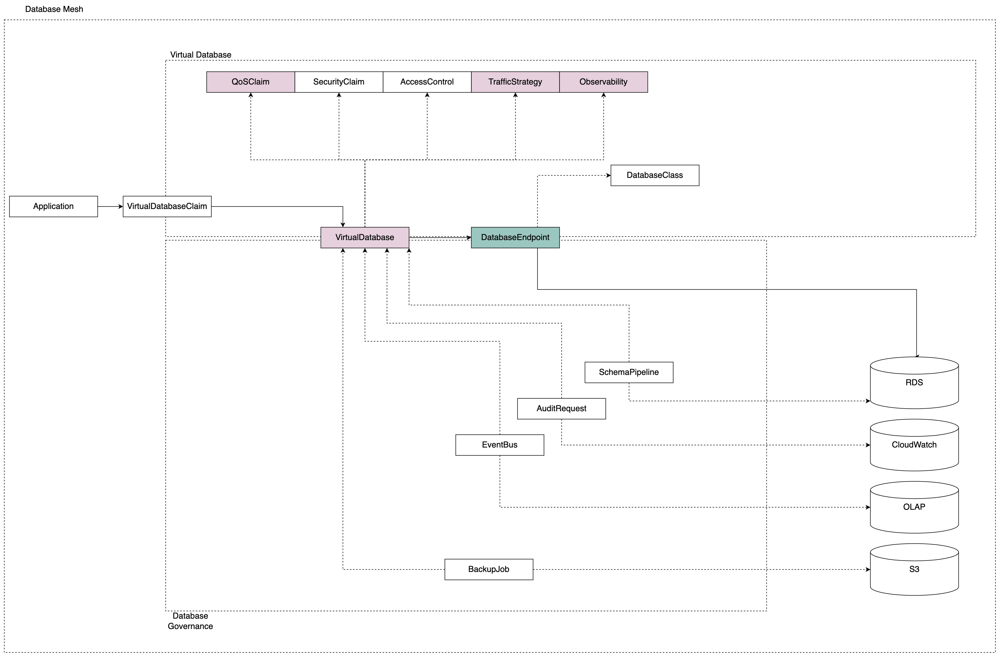

# 3. Workloads

According to the definition from last chapter, Database Mesh proposed three workloads currently:
* VirtualDatabase
* DatabaseEndpoints
* TrafficStrategy
* VirtualDatabaseClaim
* DatabaseClass 
* QoSClaim
* SecurityClaim
* AccessControl
* Observability
* SchemaPipeline
* AuditRequest
* EventBus
* BackupJob

All of these workloads work together like below:

