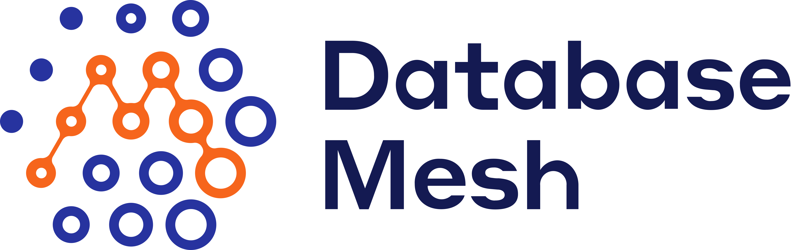

# Database Mesh

Database Mesh is a framework specification for databases governance in the cloud native era. With the help of abstraction and standarderization of multiple databases governance actions, Database Mesh provides developers truely transparent database access experience, supports comsistent governance interface and variety automation tasks, boosts the transformation from Infrastructure as Code to Infrastructure Governance as Code.

## Introduction

With the fast growing of microservices, the dependency relationship of these service instsances looks like a hugh graph which brings great management challenge. Different microservices show different need of databases, it also need an efficient way to manage all of these databases. With the help of Kubernetes, application deployment on scale becomes more convienent, and Service Mesh provides a solution for microservice governance in cloud native architecture. However, there is no such solution for databases.

<!-- add arch -->

Database Mesh is proposed as a governance framework for databases in cloud native environments follows the principles below:
* Database is first-class resource: All of the behavior are derived from the governance actions of databases. 
* Engineer-Friendly: Database Mesh let developers only need to care about which protocol of database, no worries about the operation characteristics of the database. Meanwhile Database Mesh help SRE and DBA to implement automation of database operationin declarative way.
* Cloud Native: With an open community to adopt databases from different cloud vendors, built on top of cloud native arcitecture, no vendor lock-in.

Database Mesh hopes to:
* Less burden of developers to boost business. 
* Achieve a framework which includes database traffic, runtime resource and reliability for   databases in a configurable, pluggable, and programmable way.
* Provide a standard interface for variety of databases like heterogeneous database, cloud-native database and distributed database.

## Specification 

The following documents are working in progress:

|                               |         Latest Release             | 
| :----------------------------: | :--------------------------------: |
| Database Mesh |  [v0.1.0](/SPEC.md) |

## Community

| | |
|:-|:-|
| Mailing List| https://groups.google.com/g/database-mesh |
| Dev Meetings (Starting Feb 27th, 2022), Bi-weekly Wednesday 9:00AM PST|https://meet.google.com/yhv-zrby-pyt |
| Dev Meetings APAC Friendly (Starting April 27th, 2022), Bi-weekly APAC Wednesday 9:00PM GMT+8|https://meeting.tencent.com/dm/6UXDMNsHBVQO |
| Wechat Broker|pisanix|
| Slack |https://databasemesh.slack.com/  |
| Meetings Notes |https://bit.ly/39Fqt3x |
<!-->

## Support

Whether you are a user or contributor, you can open issues on GitHub:

* [Issues](https://github.com/database-mesh/database-mesh/issues)

## Community Code of Conduct

Database Mesh follows the [CNCF Code of Conduct](https://github.com/cncf/foundation/blob/master/code-of-conduct.md).

